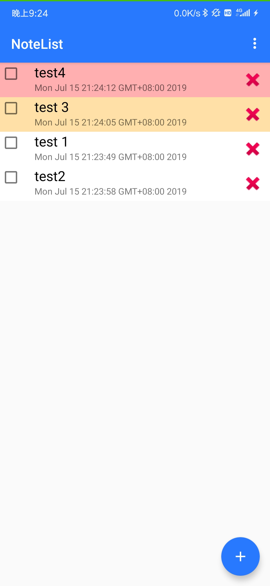

# Chapter 6

这次作业主要利用数据库实现一个TodoList应用。这次作业主要使用Kotlin与Java混编，利用Room实现数据库数据的增删改查。

## 开发过程中的坑

build.gradle应为
```
    //Room
    implementation 'android.arch.persistence.room:runtime:1.1.1'
    implementation 'android.arch.persistence.room:rxjava2:1.1.1'
    kapt 'android.arch.persistence.room:compiler:1.1.1'
```
否则会出现运行时错误can't find implementation

# APK

生成的apk文件在apk文件夹中

# 程序截图

该TodoList应用支持3种优先级：高（红）、中（黄）、低（白），显示列表按优先级进行排序。

